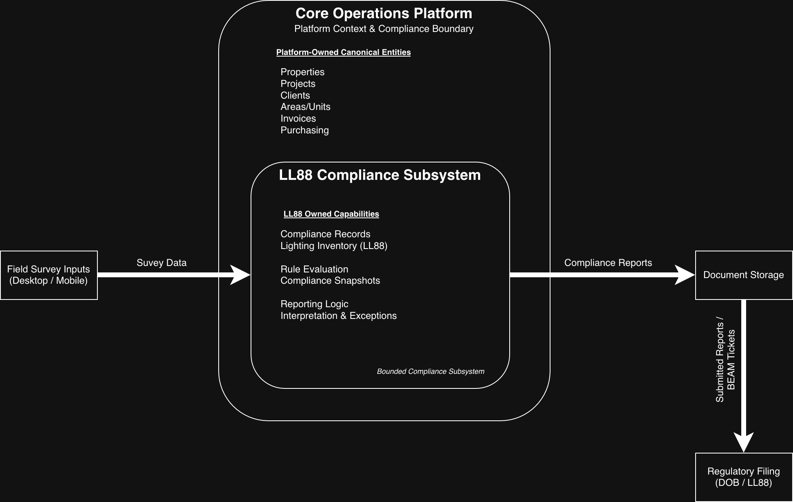
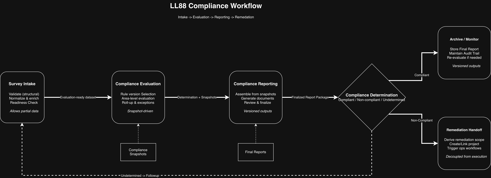

# LL88 Compliance Subsystem  
*Bounded Compliance Module within an Operations Platform*

## System Overview

Local Law 88 (LL88) imposes lighting efficiency and control requirements across large building portfolios in New York City, with strict deadlines, audit exposure, and evolving interpretations that often require iterative review and human judgment.

This repository documents the **LL88 compliance subsystem** implemented within a broader internal operations platform already responsible for managing properties, projects, invoicing, purchasing, and related regulatory workflows. Introducing LL88 compliance into this environment required supporting high-volume survey intake, defensible compliance evaluation, and repeatable reporting **without fragmenting data ownership or duplicating core business entities**.

Rather than existing as a standalone application or database, LL88 compliance is treated as a **bounded subsystem**: it owns compliance-specific logic, workflows, and artifacts while sharing canonical entities (e.g., Properties, Projects, Invoices) with the core platform. This approach allows compliance logic to evolve independently while preserving a single source of truth for operational data.

This documentation focuses on **architecture, data ownership boundaries, workflows, constraints, and key design decisions**, intentionally avoiding platform-specific or implementation-level details.

**Audience:** Architects, senior engineers, and technical stakeholders reviewing system design, boundaries, and tradeoffs.
---

## Documentation
  
### Architecture
- [Platform Context Diagram](architecture/platform-context.png)
- [End-to-End Compliance Workflow](architecture/ll88-end-to-end-flow.png)
- [ADR-001: LL88 as a Bounded Subsystem](architecture/adr-001-ll88-bounded-subsystem.md)
  
### Data
- [Shared vs Owned Data Model](data/shared-vs-owned.md)
- [Tables in Scope](data/tables-in-scope.md)
  
### Workflows
- [Survey Intake Workflow](workflows/intake.md)
- [Compliance Evaluation Workflow](workflows/evaluation.md)
- [Compliance Reporting Workflow](workflows/reporting.md)
- [Remediation Handoff Workflow](workflows/remediation-handoff.md)

---

## Problem Statement

NYC Local Law 88 requires building owners to:
- Survey existing lighting systems
- Determine compliance status
- Produce formal documentation
- Coordinate filings and incentive programs
- Meet strict regulatory deadlines

In practice, this process involves:
- Incomplete or inconsistent field data
- Multi-building portfolios
- Manual documentation bottlenecks
- Tight coupling between compliance, operations, and billing

A standalone compliance tool would duplicate data and introduce risk.  
The challenge was to **embed compliance intelligence into an existing operational system without fragmenting data ownership**.

---

## System Context

The LL88 subsystem operates within a **modular monolith** architecture:

- The **core platform** manages:
  - Properties
  - Projects
  - Clients
  - Invoices
  - Purchasing
- The **LL88 subsystem** manages:
  - Compliance rules and interpretations
  - Survey-derived compliance attributes
  - Analysis and reporting workflows
  - Regulatory documentation outputs

This approach preserves a **single source of truth** while allowing compliance logic to evolve independently.

---

## Architecture Overview

---

## End-to-End Compliance Workflow

---

## Subsystem Boundary

### LL88 Subsystem Owns
- Compliance status determination
- Lighting inventory classification for LL88
- Rule evaluation (compliant / non-compliant)
- Compliance reporting logic
- Regulatory documentation generation
- Compliance audit history

### Shared (Read/Write via Platform Contracts)
- Properties
- Projects
- Units / Areas
- Invoices
- Client records

### External Touchpoints
- Field survey inputs (manual + mobile)
- Document storage systems
- Utility incentive coordination
- Regulatory filing workflows

---

## Key Workflows

1. **Survey Intake**
   - Field data captured via desktop and mobile workflows
   - Validation against required compliance attributes
   - Flagging of incomplete or ambiguous inputs

2. **Compliance Analysis**
   - Lighting inventory classified against LL88 rules
   - Exceptions and edge cases handled explicitly
   - Compliance status calculated at area, building, and portfolio levels

3. **Reporting & Documentation**
   - Automated generation of compliance summaries
   - Standardized regulatory output formats
   - Traceability back to source survey data

4. **Operational Handoff**
   - Non-compliant findings routed into project workflows
   - Install scope derived from compliance gaps
   - Incentive eligibility aligned with findings

5. **Audit & Change Tracking**
   - Historical snapshots of compliance status
   - Support for re-surveys and rule interpretation changes

---

## Architecture Highlights

- **Bounded context within a shared data model**
- **Event-driven automation** (status changes trigger downstream actions)
- **Server-side processing** for document generation and batch operations
- **Explicit separation between compliance logic and financial workflows**
- **Designed for regulatory ambiguity and exception handling**

---

## Constraints & Tradeoffs

### Constraints
- Regulatory rules subject to interpretation
- Survey data quality varies by site and access
- Deadlines impose hard operational cutoffs
- System must support partial data states

### Tradeoffs Made
- Modular monolith chosen over microservices to reduce operational overhead
- Shared entities preferred over duplication to maintain data integrity
- Documentation-first automation favored over opaque logic

---

## Outcomes

### Architectural Outcomes
- Reduced manual compliance processing time
- Improved auditability and traceability
- Enabled multi-building compliance management
- Minimized data duplication across operations and compliance

*(Quantitative metrics intentionally omitted / anonymized.)*

### Operational Impact
This subsystem has been used in production to support LL88 compliance activities for more than **400 buildings** over the past year.

The architecture enabled the organization to:
- Perform high-volume survey intake across diverse building types
- Iteratively evaluate compliance under evolving interpretations and edge cases
- Generate defensible, auditable compliance reports at scale
- Cleanly hand off non-compliant findings into remediation and incentive workflows

By embedding LL88 compliance as a bounded subsystem within the existing operations platform, the organization was able to introduce LL88 as a new operational and revenue-generating capability without duplicating core data, fragmenting ownership, or destabilizing existing workflows.

---

## Security & Data Handling

- Client and property data anonymized in this documentation
- No production data, credentials, or proprietary logic included
- All examples use sanitized or representative structures

---

## What I’d Refine Earlier

- Earlier formalization of subsystem boundaries
- Clearer contracts around shared entities
- Greater separation between survey ingestion and compliance evaluation
- Earlier investment in mobile-first survey tooling

These lessons directly informed later architectural decisions.

---

## Related Work

This subsystem exists within a broader platform ecosystem, including:
- Mobile survey architecture (documented separately)
- Incentive and rebate workflow automation
- Controls and lighting system design subsystems

---

## Author Notes

This repository is intended to demonstrate **systems thinking, architectural decision-making, and real-world constraint handling**, rather than platform-specific implementation details.
